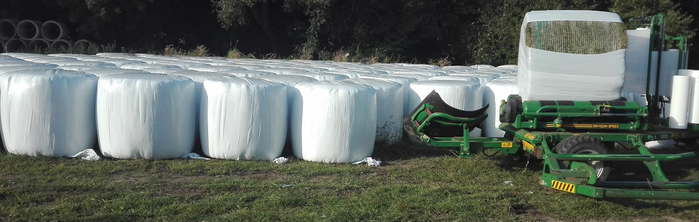
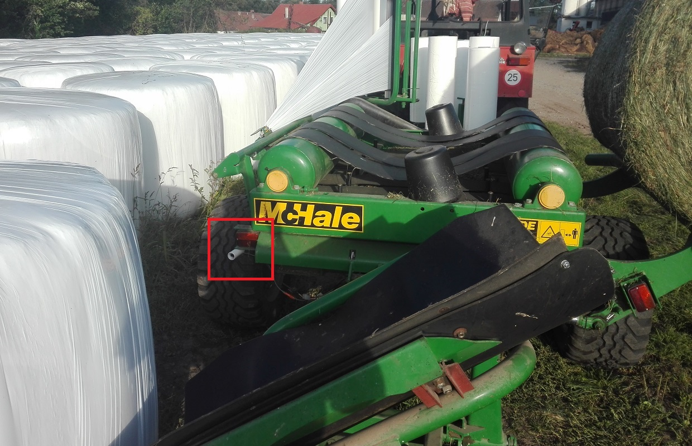
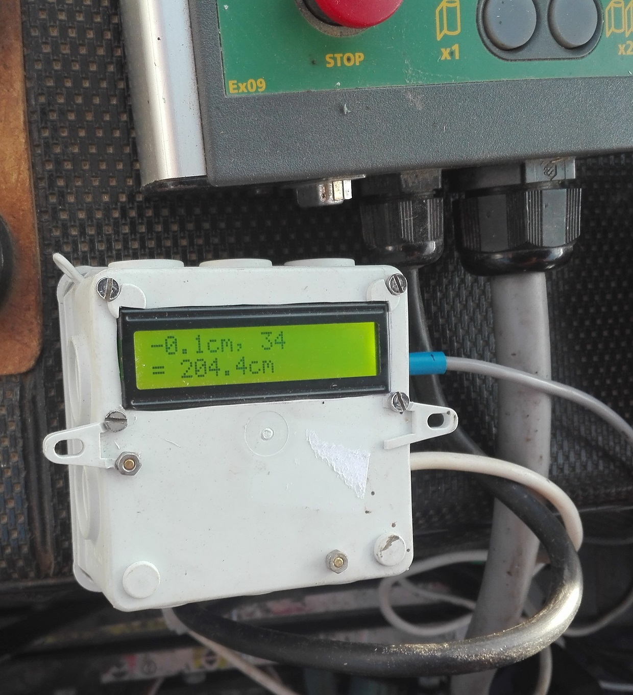

## A project using:
- [50m/164ft Laser Distance Measuring Sensor](https://www.aliexpress.com/item/32793950499.html?spm=2114.12010610.8148356.13.781e399eK4pNj7)
(do not recommend this model, it has [very tiny pcb pads](laser.jpg) for soldering RX/TX wires - different from the shop's photo, 100m model should be better)
- Arduino Uno
- I2C LCD
- button for tare

## Used for a proper positioning of bales:

Inspired by https://dspace.cvut.cz/handle/10467/88824:
- https://dspace.cvut.cz/bitstream/handle/10467/88824/F1-BP-2020-Vurbsova-Barbora-barbora_vurbsova_bp_2020.pdf  
- https://github.com/BaraVu/Arduino_laser_distance

Laser sensor manual from https://forum.arduino.cc/index.php?topic=654873.0:
- [manual 1](https://raw.githubusercontent.com/krasa/ArduinoLaserDistance/master/manual%201.jpg)
- [manual 2](https://raw.githubusercontent.com/krasa/ArduinoLaserDistance/master/manual%202.jpg)
- [manual 3](https://raw.githubusercontent.com/krasa/ArduinoLaserDistance/master/manual%203.jpg)
- [manual 4](https://raw.githubusercontent.com/krasa/ArduinoLaserDistance/master/manual%204.jpg)

Laser sensor manual from https://www.aliexpress.com/item/32823813140.html
original: https://docs.google.com/document/d/1HsL_9KzcfB_PNKFYGeJOcuiPVrhMToLMy2be7qqlkxU/edit?usp=sharing
translated: https://docs.google.com/document/d/1gwpniE1pFN0SOfniM_q6_8ykEQjoZO2nr0ZpE9tjOwc/edit?usp=sharing
